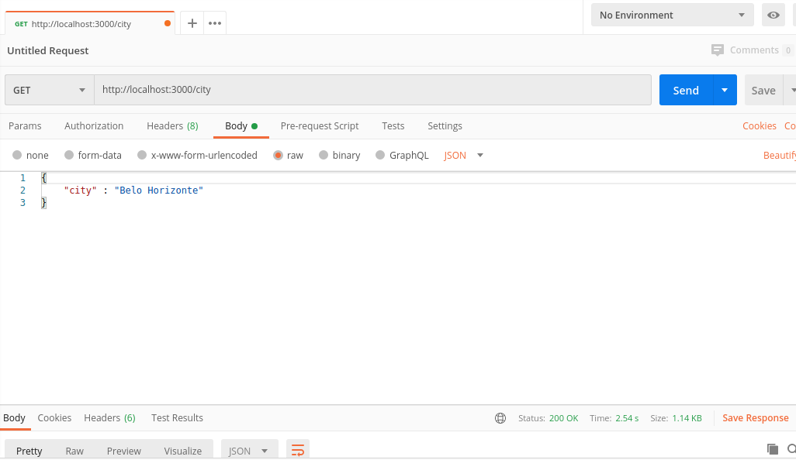
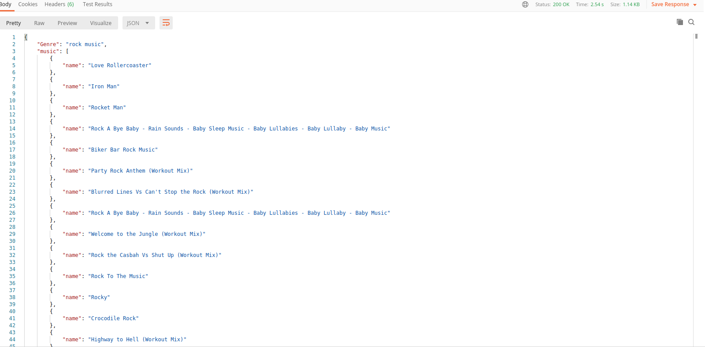
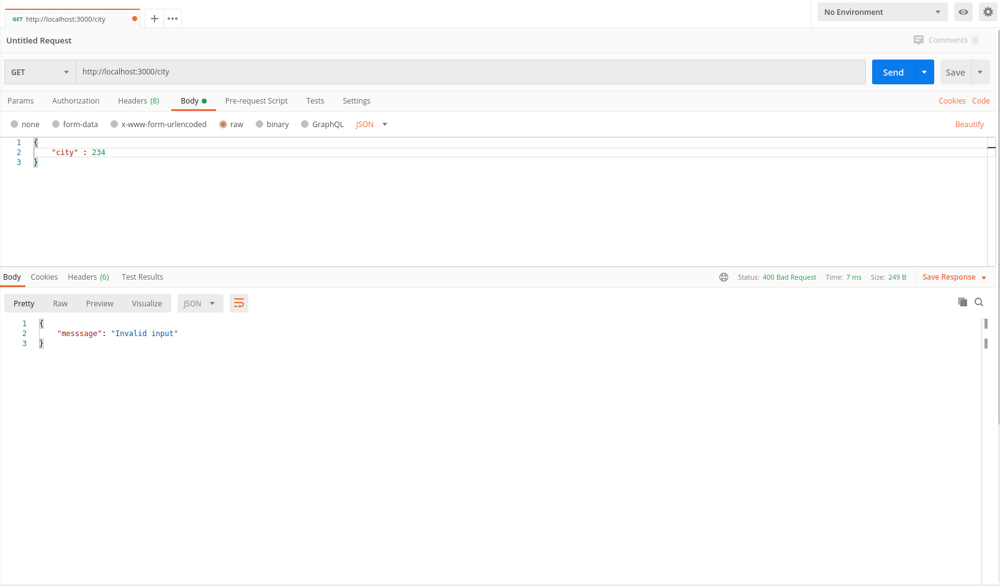
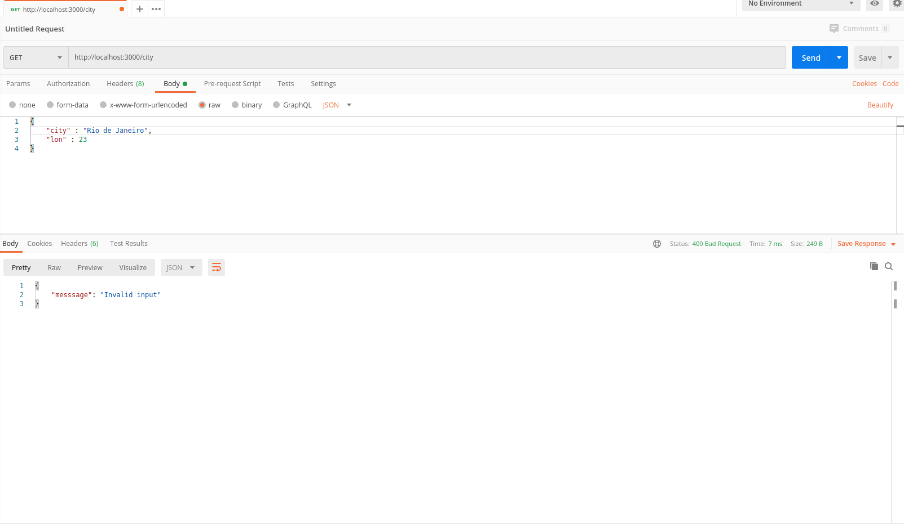
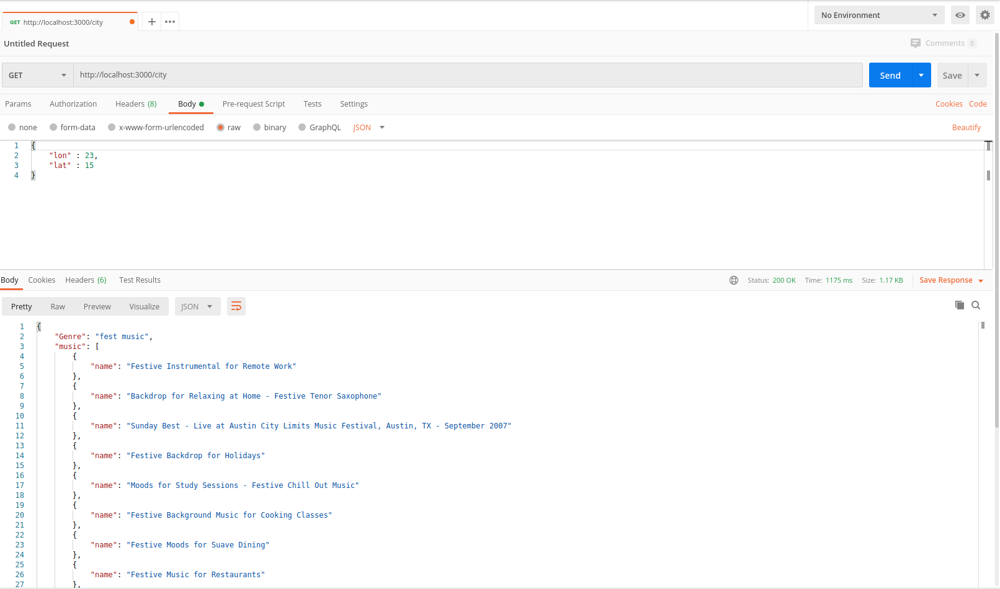
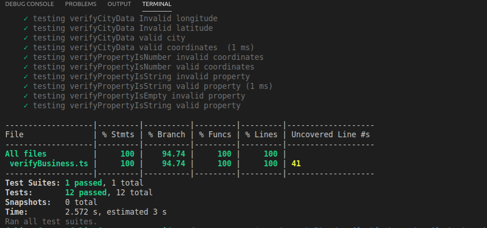

# desafio-back-End-Big-Bang

Projeto do desafio back end

## Principais tecnologias utilizadas
1 Node
2 Typescript
3 Arquitetura MVC
4 Express
5 Dotenv
6 Jest
7 spotify-web-api-node

# Escopo

O projeto tem inteção de sugerir músicas a partir da temperatura da cidade escolhida. Utilizando buscas no spotify e no OpenWeatherMap.

# Regras de negócio

Se a temperatura (Celsius) estiver acima de 30 graus, sugerir músicas para festa
Se a temperatura está entre 15 e 30 graus, sugerir músicas do gênero Pop.
Entre 10 e 14 graus, sugerir músicas do gênero Rock
Abaixo de 10 graus, segerir músicas clássicas.

# Abaixo telas do postman com algumas solicitações e respectivas respostas

# Tela testes

